# Beutech Vacation Timeline Widget
## Technical Documentation & Architecture Guide

**Version:** 1.0
**Last Updated:** February 2026
**Platform:** Staffbase Custom Widget + Azure Functions Backend

---

## Executive Summary: What This Widget Does

### The Problem
Managing team vacations is chaotic. Employees email their manager, managers track approvals in spreadsheets, and nobody knows who's out until someone misses a meeting. HR spends hours manually updating calendars.

### The Solution
**Beutech Vacation Timeline** is a one-stop vacation management widget that lives inside your Staffbase intranet. Employees see it every day, right where they already work.

### What It Does (In Plain English)

| Feature | What It Means |
|---------|---------------|
| 📅 **Visual Calendar** | See who's on vacation at a glance - by day, week, or month |
| 📝 **Request Time Off** | Employees submit vacation requests in 30 seconds |
| ✅ **Approve/Reject** | Managers handle approvals with one click |
| 📧 **Outlook Sync** | Approved vacations appear in company Outlook calendars automatically |
| 🌍 **Multi-Language** | Works in English, German, French, and Spanish |
| 📱 **Mobile-Ready** | Works on phones, tablets, and desktops |

### Who Benefits

| Role | Benefit |
|------|---------|
| **Employees** | Request time off without leaving Staffbase. See team availability instantly. |
| **Managers** | Approve requests from anywhere. No more lost email threads. |
| **HR** | Zero manual calendar updates. Full audit trail of all requests. |
| **IT** | Self-contained widget. Secure API. Easy to deploy and maintain. |

### The Bottom Line
- **Before:** 15+ minutes to request and approve a vacation
- **After:** Under 2 minutes, fully tracked, automatically synced

---

## Table of Contents

1. [System Overview](#1-system-overview)
2. [Architecture Diagram](#2-architecture-diagram)
3. [Data Flow Diagrams](#3-data-flow-diagrams)
4. [Features & Capabilities](#4-features--capabilities)
5. [API Reference](#5-api-reference)
6. [User Journeys](#6-user-journeys)
7. [Configuration Guide](#7-configuration-guide)
8. [Security Model](#8-security-model)
9. [Technology Stack](#9-technology-stack)

---

## 1. System Overview

The **Beutech Vacation Timeline** is an enterprise-grade vacation management widget designed for Staffbase. It provides:

- **Visual Timeline**: See team vacations at a glance (day/week/month views)
- **Request Management**: Submit time-off requests directly from the widget
- **Approval Workflow**: Supervisors can approve/reject requests
- **Microsoft 365 Integration**: Syncs with Outlook calendars via Graph API
- **Multi-language Support**: English, German, French, Spanish with auto-detection

### High-Level Architecture

```
┌─────────────────────────────────────────────────────────────────────────┐
│                           STAFFBASE PLATFORM                             │
│  ┌─────────────────────────────────────────────────────────────────┐   │
│  │                    Vacation Timeline Widget                       │   │
│  │  ┌──────────┐  ┌──────────┐  ┌──────────┐  ┌──────────────────┐ │   │
│  │  │ Calendar │  │   My     │  │Approvals │  │   New Request    │ │   │
│  │  │   View   │  │ Requests │  │Dashboard │  │     Modal        │ │   │
│  │  └────┬─────┘  └────┬─────┘  └────┬─────┘  └────────┬─────────┘ │   │
│  │       │              │              │                 │           │   │
│  │       └──────────────┴──────────────┴─────────────────┘           │   │
│  │                              │                                     │   │
│  │                    ┌─────────▼─────────┐                          │   │
│  │                    │    API Client     │                          │   │
│  │                    │  (x-api-key auth) │                          │   │
│  │                    └─────────┬─────────┘                          │   │
│  └──────────────────────────────┼────────────────────────────────────┘   │
└─────────────────────────────────┼────────────────────────────────────────┘
                                  │ HTTPS
                                  ▼
┌─────────────────────────────────────────────────────────────────────────┐
│                        AZURE FUNCTIONS BACKEND                           │
│  ┌─────────────────────────────────────────────────────────────────┐   │
│  │                      API Endpoints                                │   │
│  │  ┌────────────┐  ┌────────────┐  ┌────────────┐  ┌────────────┐ │   │
│  │  │    GET     │  │    POST    │  │    GET     │  │   POST     │ │   │
│  │  │ /vacations │  │ /requests  │  │ /requests  │  │  /approve  │ │   │
│  │  └─────┬──────┘  └─────┬──────┘  └─────┬──────┘  └─────┬──────┘ │   │
│  │        │               │               │               │         │   │
│  │        ▼               ▼               ▼               ▼         │   │
│  │  ┌─────────────────────────────────────────────────────────────┐│   │
│  │  │                    Service Layer                             ││   │
│  │  │  vacationService │ requestService │ managerService          ││   │
│  │  └─────────┬────────────────┬──────────────────┬───────────────┘│   │
│  └────────────┼────────────────┼──────────────────┼─────────────────┘   │
└───────────────┼────────────────┼──────────────────┼─────────────────────┘
                │                │                  │
        ┌───────▼───────┐  ┌─────▼─────┐    ┌──────▼──────┐
        │ Microsoft 365 │  │PostgreSQL │    │   Email     │
        │  Graph API    │  │  (Neon)   │    │  Service    │
        └───────────────┘  └───────────┘    └─────────────┘
```

---

## 2. Architecture Diagram

### Component Architecture

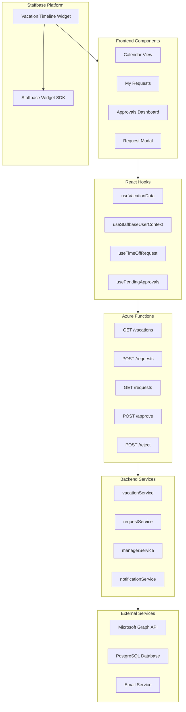

### Database Schema

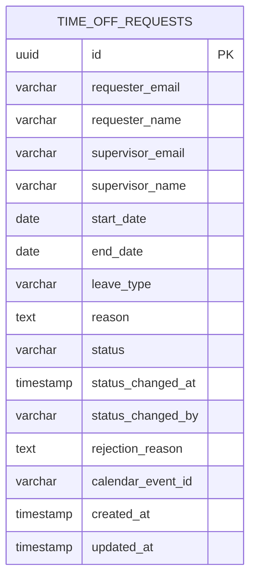

---

## 3. Data Flow Diagrams

### 3.1 View Vacations Flow

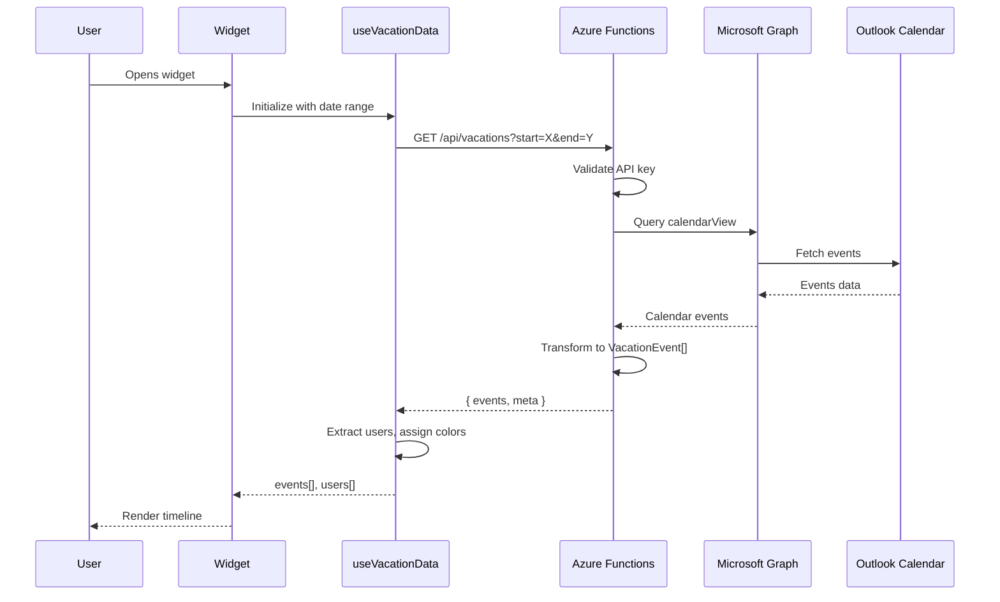

### 3.2 Submit Request Flow

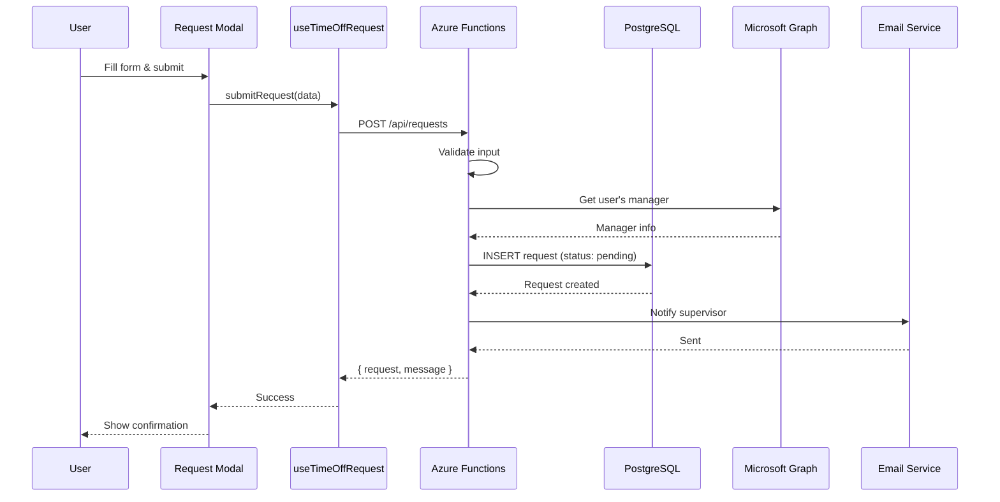

### 3.3 Approval Flow

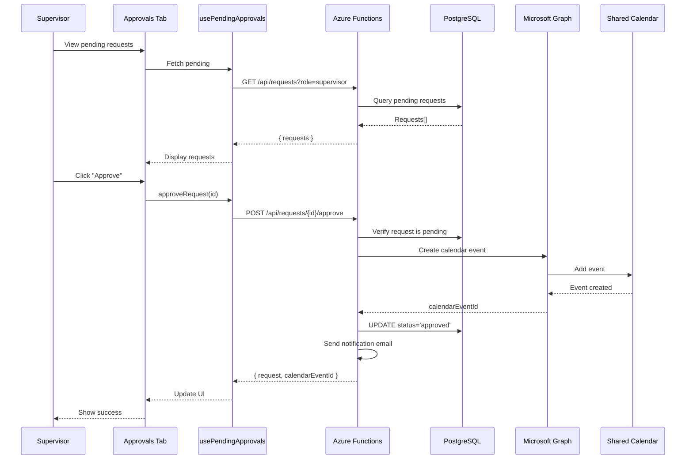

### 3.4 User Context Resolution Flow

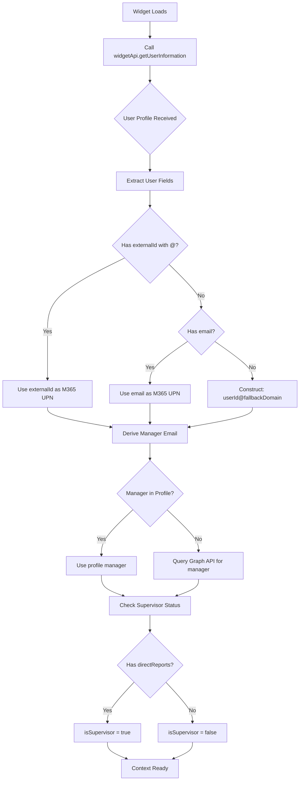

---

## 4. Features & Capabilities

### Feature Matrix

| Feature | Description | User Types |
|---------|-------------|------------|
| **Calendar Views** | Day, Week, Month grid views | All users |
| **Timeline View** | Horizontal resource timeline | All users |
| **User Filtering** | Filter by specific team members | All users |
| **Color Legend** | Color-coded user identification | All users |
| **Date Navigation** | Jump to any date via dropdown | All users |
| **Today Marker** | Visual indicator for current date | All users |
| **Request Submission** | Submit time-off requests | All users |
| **My Requests** | View own request history | All users |
| **Pending Approvals** | Review team requests | Supervisors only |
| **Approve/Reject** | Process pending requests | Supervisors only |
| **Email Notifications** | Alerts for request status | All users |
| **Outlook Deep Link** | Jump to full Outlook calendar | All users |
| **Multi-language** | EN, DE, FR, ES support | All users |

### View Modes

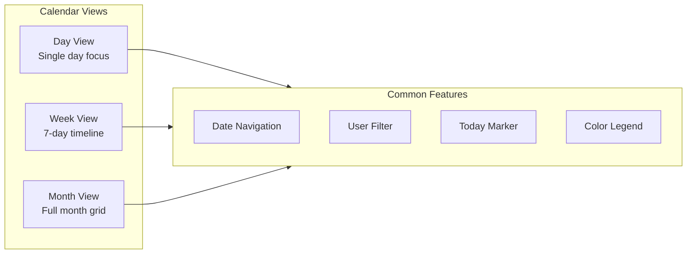

### Request Lifecycle

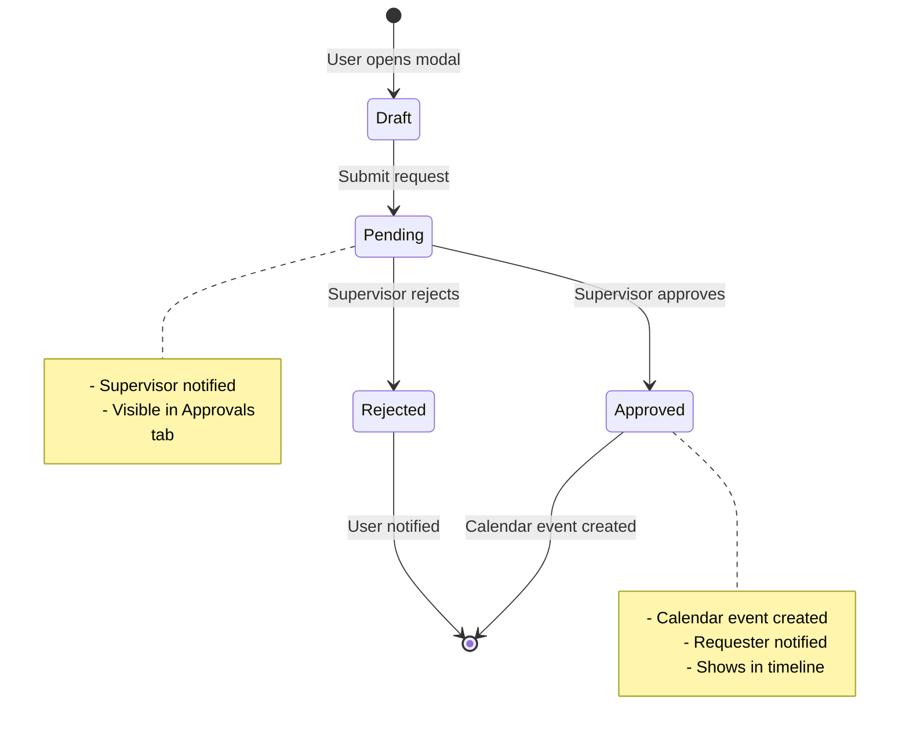

---

## 5. API Reference

### Authentication

All API requests require the `x-api-key` header:

```http
x-api-key: your-api-key-here
```

### Endpoints Overview

| Method | Endpoint | Description |
|--------|----------|-------------|
| GET | `/api/vacations` | Fetch vacation events |
| GET | `/api/vacations/next-event` | Get next upcoming event |
| POST | `/api/requests` | Create time-off request |
| GET | `/api/requests` | List requests |
| POST | `/api/requests/{id}/approve` | Approve request |
| POST | `/api/requests/{id}/reject` | Reject request |
| GET | `/api/health` | Health check |

### GET /api/vacations

**Query Parameters:**

| Parameter | Type | Required | Description |
|-----------|------|----------|-------------|
| start | ISO date | Yes | Start of date range |
| end | ISO date | Yes | End of date range |
| view | string | Yes | `day`, `week`, `month` |
| users | string | No | Comma-separated emails |
| timezone | string | No | IANA timezone |

**Response:**

```json
{
  "events": [
    {
      "id": "AAMkAGI2...",
      "userId": "user@company.com",
      "userDisplayName": "John Doe",
      "userColorKey": "user@company.com",
      "title": "Vacation",
      "start": "2026-02-09T00:00:00Z",
      "end": "2026-02-12T00:00:00Z"
    }
  ],
  "meta": {
    "start": "2026-02-05T00:00:00Z",
    "end": "2026-02-12T00:00:00Z",
    "generatedAt": "2026-02-05T10:00:00.123Z"
  }
}
```

### POST /api/requests

**Request Body:**

```json
{
  "requesterEmail": "user@company.com",
  "requesterName": "John Doe",
  "startDate": "2026-06-01",
  "endDate": "2026-06-05",
  "leaveType": "vacation",
  "reason": "Summer break"
}
```

**Response (201):**

```json
{
  "request": {
    "id": "uuid",
    "status": "pending",
    "supervisorEmail": "manager@company.com",
    "createdAt": "2026-02-01T10:00:00Z"
  },
  "message": "Request submitted. Supervisor notified."
}
```

---

## 6. User Journeys

### Journey 1: Employee Views Team Calendar

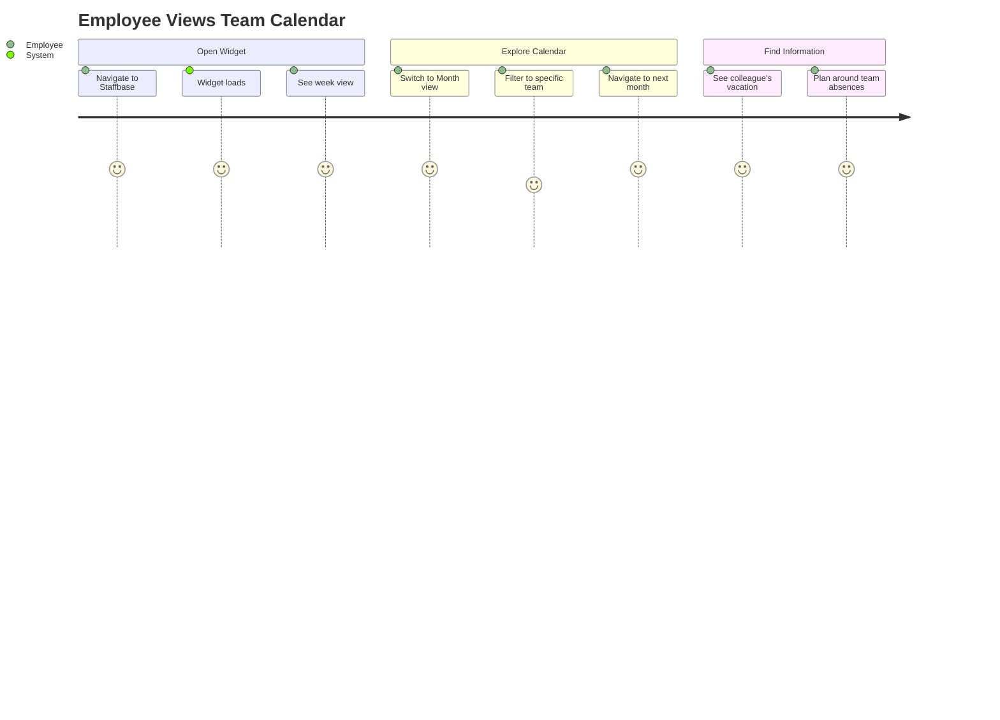

### Journey 2: Employee Submits Request

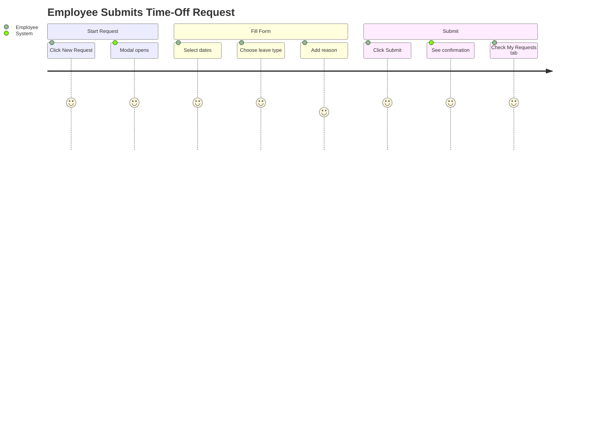

### Journey 3: Supervisor Approves Request

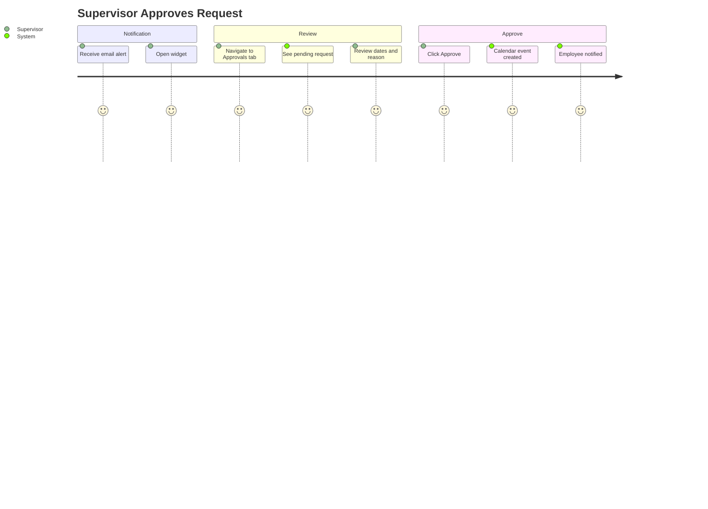

---

## 7. Configuration Guide

### Widget Configuration (Staffbase Studio)

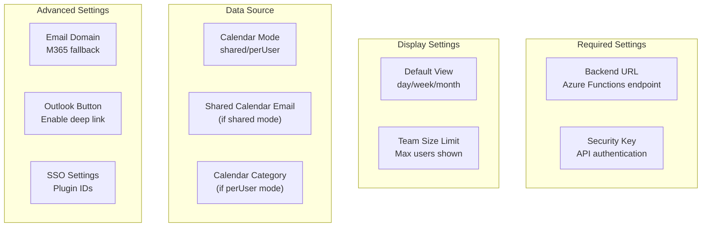

### Environment Variables (Backend)

| Variable | Description | Example |
|----------|-------------|---------|
| `TENANT_ID` | Azure AD tenant | `xxxxxxxx-xxxx-...` |
| `CLIENT_ID` | App registration ID | `xxxxxxxx-xxxx-...` |
| `CLIENT_SECRET` | App secret | `xxxxx` |
| `DATABASE_URL` | PostgreSQL connection | `postgresql://...` |
| `API_KEY` | API authentication key | `secure-key` |
| `ALLOWED_ORIGINS` | CORS allowed origins | `https://company.staffbase.com` |
| `CALENDAR_MODE` | shared or perUser | `shared` |
| `VACATION_CALENDAR_MAILBOX` | Shared calendar email | `vacations@company.com` |

---

## 8. Security Model

### Authentication & Authorization

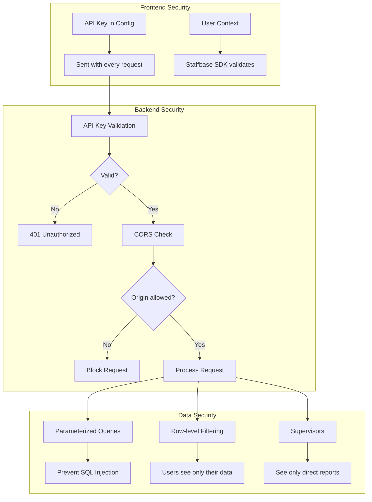

### Security Measures

| Layer | Measure | Purpose |
|-------|---------|---------|
| Transport | HTTPS | Encrypt data in transit |
| Authentication | API Key | Validate widget identity |
| Authorization | Role-based | Supervisor vs employee access |
| CORS | Origin whitelist | Block unauthorized domains |
| Database | Parameterized queries | Prevent SQL injection |
| Logging | Structured logs | Audit trail |

---

## 9. Technology Stack

### Frontend

| Technology | Purpose |
|------------|---------|
| React 18 | UI framework |
| TypeScript | Type safety |
| i18next | Internationalization |
| Staffbase Widget SDK | Platform integration |
| Webpack | Build tooling |
| CSS Variables | Design system |

### Backend

| Technology | Purpose |
|------------|---------|
| Azure Functions | Serverless compute |
| Node.js 20 | Runtime |
| TypeScript | Type safety |
| Microsoft Graph SDK | M365 integration |
| Neon PostgreSQL | Serverless database |
| Zod | Input validation |

### Infrastructure

| Service | Purpose |
|---------|---------|
| Azure Functions | API hosting |
| Azure Blob Storage | Widget hosting |
| Azure Key Vault | Secrets management |
| Application Insights | Monitoring |
| GitHub Actions | CI/CD |

---

## Appendix: Quick Reference

### Status Codes

| Code | Meaning |
|------|---------|
| 200 | Success |
| 201 | Created |
| 400 | Bad Request |
| 401 | Unauthorized |
| 403 | Forbidden |
| 404 | Not Found |
| 500 | Server Error |

### Leave Types

| Value | Display |
|-------|---------|
| `vacation` | Vacation |
| `sick` | Sick Leave |
| `personal` | Personal Day |
| `other` | Other |

### Request Statuses

| Status | Description |
|--------|-------------|
| `pending` | Awaiting supervisor action |
| `approved` | Approved, calendar event created |
| `rejected` | Rejected by supervisor |

---

*Documentation generated for Beutech Vacation Timeline Widget v1.0*
